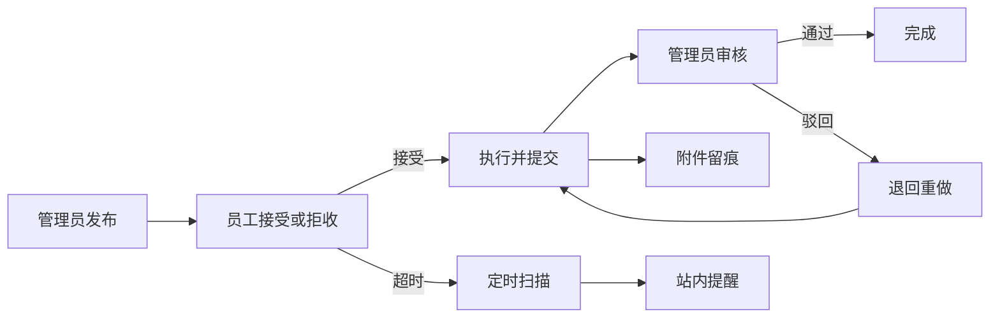
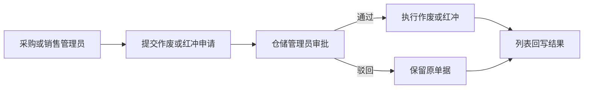

# Warehouse Management System

一个面向企业多部门协同场景的仓库管理系统，采用前后端分离架构，覆盖认证授权、用户与部门管理、商品进销退存、库存预警、统计分析等核心业务。

在传统进销存流程基础上，项目进一步补齐了工作要求闭环、历史单据审批作废/红冲、公告定向投放、站内消息提醒、超时治理，以及面向项目知识问答的 AI 助手能力，使系统同时具备业务处理、部门协同、流程追踪与智能辅助支持等实际落地价值。

## 🎯 适用业务场景 / 适合谁用

本项目适合采购、销售、仓储、财务、人事等多角色协同的中小型企业，也适合希望把进销存管理、部门协作、审批流转与项目内 AI 辅助问答放在同一套系统中的团队。

如果你的业务同时涉及商品进销退存、岗位权限区分、任务与公告协同、历史单据审批，并且希望补充面向系统流程、角色职责和页面入口的 AI 助手能力，这套系统会比较匹配。

## 🌐 在线演示

- 🔗 演示网站：https://wmsystem123.pages.dev/
- 📌 演示网站无AI助手功能，建议本地部署后体验完整功能。
- 🚀 快速部署链接：[快速部署](#quick-start)


## ✨ 项目亮点

本项目不只停留在传统进销存能力上，还把 AI 助手接入到项目知识、角色权限、页面入口与业务流程之中，让“查流程、问职责、找页面、看规则”可以和日常业务处理放在同一套系统内完成。

| 维度 | 亮点 | 价值 |
|---|---|---|
| AI 助手定位 | 面向项目知识问答的内置助手，而非通用聊天窗口 | 更适合回答系统流程、角色职责、页面入口、业务规则等项目内问题 |
| AI 助手联动 | 与角色权限、页面入口、项目文档、历史会话和模型路由打通 | 用户不必反复翻文档或找页面，能直接在系统内获得针对当前项目的答案 |
| 多模型能力 | 支持通义千问、智谱 GLM、Kimi、DeepSeek，并结合默认模型与回退链路 | 在可用性、成本与回答稳定性之间做平衡，减少单模型不可用带来的影响 |
| 权限模型 | 角色 + 部门双维权限控制 | 更贴近真实企业组织结构与权限边界 |
| 部门协同 | 人事、采购、销售、仓储、财务拥有独立工作台 | 不同岗位看到的菜单、首页指标和业务入口各不相同 |
| 任务闭环 | “工作要求”覆盖发布、接受、执行、提交、审核全流程 | 将跨部门任务转为可跟踪、可回看、可审核的闭环流程 |
| 审批追溯 | 历史单据不能直接处理，需经仓储审批后作废或红冲 | 保留审批轨迹与处理结果，提升业务可控性 |
| 消息协同 | 待办提醒、站内邮箱与超时通知统一收口 | 关键消息前置展示，减少遗漏处理成本 |
| 时效治理 | 超时状态独立记录，统一识别超时中、逾期提交、逾期完成 | 不破坏原有状态机，又能显式暴露时效风险 |
| 经营与治理 | 销售毛利分析、登录日志、操作日志、超管总览形成组合能力 | 同时兼顾业务经营分析与系统治理审计 |

### 📋 工作要求闭环速览



### 🧾 历史单据审批流速览



### 🔐 角色权限矩阵速览

| 身份 | 代表账号 | 权限范围 | 主要入口 |
|---|---|---|---|
| 超级管理员 | `superadmin` | 系统治理与安全审计 | 首页、公告管理、用户管理、超管总览、安全策略、登录日志、操作日志 |
| 人事管理员 | `hr_admin` | 人事与组织管理 | 首页、部门管理、员工管理、员工分布、通知、用户部门管理 |
| 采购管理员 | `purchase_admin` | 采购业务与库存协同 | 首页、商品进货、进货退货、预警中心、通知、用户部门管理 |
| 销售管理员 | `sales_admin` | 销售业务与库存协同 | 首页、商品销售、销售退货、预警中心、通知、用户部门管理 |
| 仓储管理员 | `warehouse_admin` | 仓储资料与审批中心 | 首页、供应商管理、商品资料、预警中心、作废审批、通知、用户部门管理 |
| 财务管理员 | `finance_admin` | 经营分析与报表查看 | 首页、销售统计图表、通知、用户部门管理 |
| 部门员工 | `*_employee` | 员工工作台与个人信息维护 | 单页工作台、工作要求、公告提醒、部门信息、手机号邮箱维护 |


## 👤 默认账号（可按需修改）

- `superadmin`：超级管理员，聚焦系统治理与安全审计管理
- `hr_admin`：人事管理员
- `purchase_admin`：采购管理员
- `sales_admin`：销售管理员
- `warehouse_admin`：仓储管理员
- `finance_admin`：财务管理员
- `*_employee`：对应部门员工账号

默认密码：123456

## 🛠️ 技术栈

- 前端：Vue 3、Vite、Element Plus、Pinia、Vue Router、Axios、ECharts
- 后端：Spring Boot 3.3.5、MyBatis-Plus 3.5.5、Sa-Token 1.37.0
- 数据库：MySQL 8.0
- 运行环境：JDK 17、Node.js 16+

## 📦 环境准备

- JDK 17：后端基于 Spring Boot 3，必须有 Java 17 环境。
- Maven（MVN）：用于编译和启动后端。项目自带 Maven Wrapper（`mvnw` / `mvnw.cmd`）(即使未全局安装 Maven 也通常可以直接运行)。
- Node.js（建议 18+）和 npm：前端基于 Vue 3 + Vite，需要用 npm 安装依赖并启动前端。
- MySQL 8.0：项目数据存储在 MySQL，需先执行初始化 SQL 脚本。


## 📁 目录结构

```text
.
├─front/                 # Vue 前端
├─back/                  # Spring Boot 后端
└─db.sql                 # 数据库初始化脚本
├─README.md              # 项目说明文档
├─AImd/                  # AI 助手相关文档
├─projectmd/             # 项目说明文档目录
```


<a id="quick-start"></a>

## 🚀 快速开始

### 1. 拉取项目

```bash
git clone https://github.com/shanqiu127/Warehouse-Management-System-.git
cd Warehouse-Management-System-
```


### 2. 初始化数据库

1. 打开数据库管理工具（如：Navicat、DBeaver 等），执行根目录数据库脚本：`db.sql`即可。
2. 正常导入整份脚本即可；如果你的工具不允许在导入时自动建库，再手动创建 `warehouse_management` 数据库。


### 3. 更改application.properties配置文件

请根据你的本机环境修改 `back/src/main/resources/application.properties` 中的数据库连接配置，`spring.datasource.username` 和 `spring.datasource.password`。

完成这一步后，小白用户只需要在项目根目录运行下面两个命令之一。（注意是之一，不要两个都运行），如果不想使用脚本，也可以手动执行后续步骤。


### 4.1脚本执行
如果你不使用 AI 助手，直接运行：

```bat
.\start-no-ai.bat
```
脚本会自动：
- 启动后端
- 检查前端依赖，缺少时自动执行 `npm install`
- 启动前端

#### 如果你要连同 AI 助手一起使用，直接运行：
```bat
.\start-with-ai.bat
```
脚本会自动：
- 首次提示填写 AI 助手模型 Key，并生成本地 `back/assistant-llm.env`
- 启动后端
- 检查前端依赖，缺少时自动执行 `npm install`
- 启动前端
后端默认地址：`http://localhost:8080`
前端默认地址：`http://localhost:5173`

### 4.2手动执行

如果你不想使用上面的脚本，也可以手动执行：
后端启动：
```bash
cd back
.\mvnw.cmd -DskipTests compile
.\mvnw.cmd spring-boot:run
```
前端启动：
```bash
cd front
npm install
npm run dev
```

如果需要 AI 助手，再在 back 目录下新建 `assistant-llm.env` 文件，至少配置一个可用模型的 API Key：
```env
QWEN_API_KEY=
GLM_API_KEY=
KIMI_API_KEY=
KIMI_ENDPOINT=https://api.moonshot.cn/v1/chat/completions
KIMI_MODEL_CODE=moonshot-v1-8k
DEEPSEEK_API_KEY=
```


## ⚠️ 注意事项

### 可选更改
- back/src/main/resources/application.properties 中 `app.upload.base-path` 当前建议使用相对路径 `../uploads`。
	- 该配置表示：当你在 `back` 目录启动后端时，上传图片会落到项目根目录下的 `uploads/` 文件夹。
	- 如果你希望上传文件落到别的位置，可以按本机环境改成其他相对路径或绝对路径。
- AI 助手模型密钥建议统一放在本地 `back/assistant-llm.env` 文件中，方便管理和切换。也可以直接修改 `application.properties` 中的环境变量引用，但不建议直接把 Key 写在 `application.properties` 中。
- db.sql 中初始化的默认账号和密码（当前为 `superadmin`、`hr_admin`、`purchase_admin`、`sales_admin`、`warehouse_admin`、`finance_admin` 及各部门 `*_employee`，默认密码均为 `123456`）可按需调整。（应用于登录系统时的默认账号密码）
- back/src/main/java/org/example/back/service/UserManageService.java 中的默认密码为 `123456`。（应用于新建用户时的默认密码）
- 这两个是不一样的，前者是数据库初始化时的默认账号密码，后者是通过用户管理界面新建用户时的默认密码。


## 📚 接口文档

- Knife4j：`http://localhost:8080/api/doc.html#/home`
- Swagger UI：`http://localhost:8080/api/swagger-ui/index.html`

---

如果这个项目对你有帮助，欢迎 Star。
