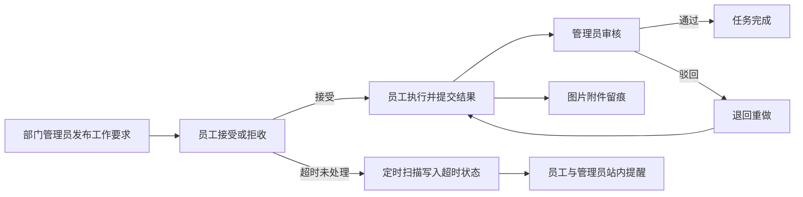
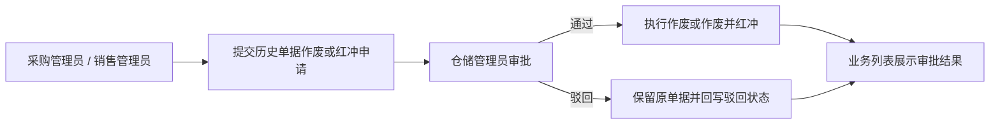
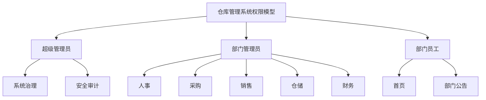

# Warehouse Management System

一个基于前后端分离架构的仓库管理系统，覆盖认证授权、系统管理、基础资料、进销退存业务与销售统计分析。

## 项目亮点

这是一个面向多部门协作场景的仓库管理系统，当前版本的核心特色已经从“进销存 + 权限控制”扩展到“部门协同 + 任务闭环 + 超时治理 + 审批追溯 + 安全审计”一体化能力。

| 维度 | 亮点 | 价值 |
|---|---|---|
| 权限模型 | 角色 + 部门双维权限控制 | 不再停留在简单管理员/员工二分，更接近真实企业组织结构 |
| 部门协同 | 人事、采购、销售、仓储、财务拥有独立工作台 | 不同部门看到不同菜单、首页指标和业务入口 |
| 任务协同 | 新增“工作要求”模块，覆盖管理员发布、员工接受/执行/提交、管理员审核 | 把跨部门日常任务从口头通知转为可追踪、可回看、可审核的流程闭环 |
| 时效治理 | 工作要求超时独立落库，支持“超时中 / 逾期提交 / 逾期完成”统一口径 | 不破坏原业务状态机，又能把任务时效风险显式暴露出来 |
| 首页提醒 | 员工待接受提醒、员工超时提醒、管理员待审核提醒、仓储审批提醒按角色展示 | 关键待办直接出现在首页，不需要用户自己翻页面找任务 |
| 历史单据治理 | 历史单据不能直接处理，需提交仓储审批后作废或红冲 | 审计追溯更完整，业务风险更可控 |
| 信息投放 | 公告支持管理员首页摘要过滤，以及管理员、全员、部门员工定向分发 | 首页信息更聚焦，公告按角色和部门自动收口，避免越权可见 |
| 消息协同 | 站内邮箱支持红点提醒、逐条已读、一键已读与删除全部已读，工作要求超时可直接触达员工与管理员 | 员工变更、任务超时、审批待办等关键信息统一收口到同一消息通道 |
| 执行留痕 | 工作要求执行结果支持文本 + 图片上传，本地文件存储与数据库路径分离 | 任务执行过程有证据、有附件、有审核记录，便于复盘与追责 |
| 组织分析 | 人事管理员可查看员工分布图表，覆盖普通员工、部门管理员与超级管理员归口展示 | 组织结构、部门构成与人员分布变化更直观 |
| 经营分析 | 销售统计和毛利看板分层开放 | 支持经营分析，同时保证财务数据边界 |
| 安全治理 | IP 策略、登录日志、操作日志、超管总览形成闭环 | 兼顾业务管理与系统治理能力 |

### 工作要求闭环速览



### 历史单据审批流速览



### 角色权限矩阵速览

| 身份 | 代表账号 | 权限范围 | 主要入口 |
|---|---|---|---|
| 超级管理员 | `superadmin` | 系统治理与安全审计 | 首页、公告管理、用户管理、超管总览、安全策略、登录日志、操作日志 |
| 人事管理员 | `hr_admin` | 人事与组织管理 | 首页、全部门管理、全员工管理、员工分布图表、通知（工作要求 / 公告管理）、用户部门管理 |
| 采购管理员 | `purchase_admin` | 采购业务与库存协同 | 首页、商品进货、进货退货、预警中心、通知（工作要求 / 公告管理）、用户部门管理 |
| 销售管理员 | `sales_admin` | 销售业务与库存协同 | 首页、商品销售、销售退货、预警中心、通知（工作要求 / 公告管理）、用户部门管理 |
| 仓储管理员 | `warehouse_admin` | 仓储资料与审批中心 | 首页、供应商管理、商品资料管理、预警中心、作废审批、通知（工作要求 / 公告管理）、用户部门管理 |
| 财务管理员 | `finance_admin` | 经营分析与报表查看 | 首页、销售统计图表、通知（工作要求 / 公告管理）、用户部门管理 |
| 部门员工 | `*_employee` | 员工工作台与个人信息维护 | 不显示侧边栏，直接进入单页工作台；可查看部门化指标、档案、部门联络信息、工作要求、按所属部门过滤的公告、待接受/超时提醒，并可维护本人手机号和邮箱 |

### 角色层级关系图




## 在线演示

- 演示网站：https://wmsfront.pages.dev/
- 演示网站体验可能不够完整，建议本地部署后体验完整功能。


## 默认账号（可按需修改）

- `superadmin`：超级管理员，聚焦系统治理与安全审计管理
- `hr_admin`：人事管理员
- `purchase_admin`：采购管理员
- `sales_admin`：销售管理员
- `warehouse_admin`：仓储管理员
- `finance_admin`：财务管理员
- `*_employee`：对应部门员工账号

默认密码:123456


## 技术栈

- 前端：Vue 3、Vite、Element Plus、Pinia、Vue Router、Axios、ECharts
- 后端：Spring Boot 3.3.5、MyBatis-Plus 3.5.5、Sa-Token 1.37.0
- 数据库：MySQL 8.0
- 运行环境：JDK 17、Node.js 16+

## 环境准备

- JDK 17：后端基于 Spring Boot 3，必须有 Java 17 环境。
- Maven（MVN）：用于编译和启动后端。项目自带 Maven Wrapper（`mvnw` / `mvnw.cmd`）(即使未全局安装 Maven 也通常可以直接运行)。
- Node.js（建议 18+）和 npm：前端基于 Vue 3 + Vite，需要用 npm 安装依赖并启动前端。
- MySQL 8.0：项目数据存储在 MySQL，需先执行初始化 SQL 脚本。

## 注意事项
### 必须更改：
- back/src/main/resources/application.properties 中数据库密码请按本机环境修改。
### 可选更改：
- back/src/main/resources/application.properties 中 `app.upload.base-path` 当前建议使用相对路径 `../uploads`。
	- 该配置表示：当你在 `back` 目录启动后端时，上传图片会落到项目根目录下的 `uploads/` 文件夹。
	- 如果你希望上传文件落到别的位置，可以按本机环境改成其他相对路径或绝对路径。
- db.sql 中初始化的默认账号和密码（当前为 `superadmin`、`hr_admin`、`purchase_admin`、`sales_admin`、`warehouse_admin`、`finance_admin` 及各部门 `*_employee`，默认密码均为 `123456`）可按需调整。（应用于登录系统时的默认账号密码）
- back/src/main/java/org/example/back/service/UserManageService.java 中的默认密码为 `123456`。（应用于新建用户时的默认密码）
- 这两个是不一样的，前者是数据库初始化时的默认账号密码，后者是通过用户管理界面新建用户时的默认密码。


## 目录结构

```text
.
├─front/                 # Vue 前端
├─back/                  # Spring Boot 后端
└─db.sql                 # 数据库初始化脚本
```

## 快速开始

### 1. 拉取项目

```bash
git clone <你的仓库地址>
cd "Warehouse Management System"
```


### 2. 初始化数据库

1. 创建数据库（建议字符集 utf8mb4）。
2. 执行根目录数据库脚本：`db.sql`。
3. `db.sql` 已包含毛利看板所需成本快照字段与回填逻辑，可直接用于全新环境初始化。


### 3. 启动后端

```bash
cd back
.\mvnw.cmd -DskipTests compile
.\mvnw.cmd spring-boot:run
```

后端默认地址：`http://localhost:8080`


### 4. 启动前端

```bash
cd front
npm install
npm run dev
```

前端默认地址：`http://localhost:5173`


## 接口文档

- Knife4j：`http://localhost:8080/api/doc.html#/home`
- Swagger UI：`http://localhost:8080/api/swagger-ui/index.html`

---

如果这个项目对你有帮助，欢迎 Star。
