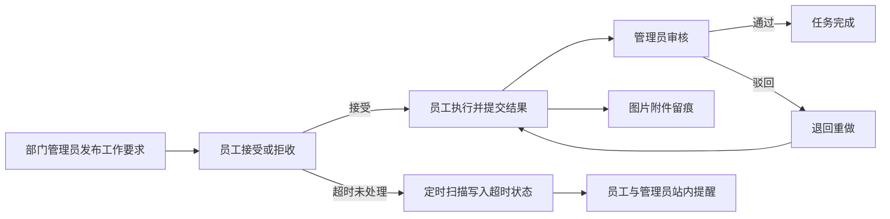
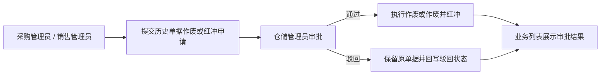

# Warehouse Management System

一个面向企业多部门协同场景的仓库管理系统，采用前后端分离架构，覆盖认证授权、用户与部门管理、供应商与商品资料维护、商品进货/销售/退货、库存预警、销售统计与毛利分析等核心业务。

项目在传统进销存流程基础上，进一步扩展了工作要求闭环、历史单据审批作废/红冲、公告定向投放、站内消息提醒、超时治理、登录与操作审计等能力，使系统不仅能支撑日常仓储业务处理，也能满足部门协同、流程追踪、责任留痕与安全治理等实际管理需求。

## 🎯 适用业务场景 / 适合谁用

本项目适合采购、销售、仓储、财务、人事等多角色协同的中小型企业，也适合希望把进销存管理、部门协作、审批流转和安全审计放在同一套系统中的团队。

如果业务同时涉及商品进销退存、岗位权限区分、任务与公告协同、历史单据审批，以及登录和操作留痕，这套系统会比较匹配。

## 🌐 在线演示

- 🔗 演示网站：https://wmsystem123.pages.dev/
- 📌 演示网站体验不够完整，建议本地部署后体验完整功能。
- 🚀 快速部署链接：[快速部署](#quick-start)


## ✨ 项目亮点

本项目并不只停留在传统“进销存系统”的基础能力上，而是围绕企业真实管理场景，进一步补齐了部门协同、任务闭环、审批追溯、消息触达、超时治理与安全审计等关键能力，使业务处理和管理治理能够落在同一套系统中。

| 维度 | 亮点 | 价值 |
|---|---|---|
| 权限模型 | 角色 + 部门双维权限控制 | 相比简单的管理员/员工二分，更贴近真实企业组织结构与权限边界 |
| 部门协同 | 人事、采购、销售、仓储、财务分别拥有独立工作台 | 不同岗位进入系统后看到的菜单、首页指标和业务入口各不相同 |
| 任务闭环 | “工作要求”模块覆盖发布、接受、执行、提交、审核全流程 | 将跨部门任务从口头通知转为可跟踪、可回看、可审核的闭环流程 |
| 时效治理 | 超时状态独立记录，统一识别超时中、逾期提交、逾期完成 | 不破坏原有业务状态机，又能显式暴露任务时效风险 |
| 首页待办 | 员工待接受、超时提醒、管理员待审核、仓储审批提醒按角色展示 | 关键待办直接前置到首页，减少翻找页面和遗漏处理的成本 |
| 审批追溯 | 历史单据不能直接处理，需经仓储审批后作废或红冲 | 保留审批轨迹与处理结果，提升审计完整性和业务可控性 |
| 信息投放 | 公告支持首页摘要过滤，并可按管理员、全员、部门员工定向分发 | 信息展示更聚焦，减少无关内容干扰并避免越权可见 |
| 消息协同 | 站内邮箱支持红点、逐条已读、一键已读与已读清理 | 将审批待办、任务超时、员工变更等关键信息统一收口到消息通道 |
| 执行留痕 | 工作要求执行结果支持文本说明与图片附件上传 | 执行过程有证据、有附件、有审核记录，便于复盘与追责 |
| 组织分析 | 人事管理员可查看员工分布图表，覆盖多角色归口统计 | 组织结构、部门构成和人员分布变化更加直观可视 |
| 经营分析 | 销售统计与毛利看板按角色分层开放 | 满足经营分析需求的同时，控制财务数据可见边界 |
| 安全治理 | IP 策略、登录日志、操作日志、超管总览形成闭环 | 在业务管理之外补齐系统治理与安全审计能力 |

### 📋 工作要求闭环速览



### 🧾 历史单据审批流速览



### 🔐 角色权限矩阵速览

| 身份 | 代表账号 | 权限范围 | 主要入口 |
|---|---|---|---|
| 超级管理员 | `superadmin` | 系统治理与安全审计 | 首页、公告管理、用户管理、超管总览、安全策略、登录日志、操作日志 |
| 人事管理员 | `hr_admin` | 人事与组织管理 | 首页、全部门管理、全员工管理、员工分布图表、通知（工作要求 / 公告管理）、用户部门管理 |
| 采购管理员 | `purchase_admin` | 采购业务与库存协同 | 首页、商品进货、进货退货、预警中心、通知（工作要求 / 公告管理）、用户部门管理 |
| 销售管理员 | `sales_admin` | 销售业务与库存协同 | 首页、商品销售、销售退货、预警中心、通知（工作要求 / 公告管理）、用户部门管理 |
| 仓储管理员 | `warehouse_admin` | 仓储资料与审批中心 | 首页、供应商管理、商品资料管理、预警中心、作废审批、通知（工作要求 / 公告管理）、用户部门管理 |
| 财务管理员 | `finance_admin` | 经营分析与报表查看 | 首页、销售统计图表、通知（工作要求 / 公告管理）、用户部门管理 |
| 部门员工 | `*_employee` | 员工工作台与个人信息维护 | 不显示侧边栏，直接进入单页工作台；可查看部门化指标、档案、部门联络信息、工作要求、按所属部门过滤的公告、待接受/超时提醒，并可维护本人手机号和邮箱 |


## 👤 默认账号（可按需修改）

- `superadmin`：超级管理员，聚焦系统治理与安全审计管理
- `hr_admin`：人事管理员
- `purchase_admin`：采购管理员
- `sales_admin`：销售管理员
- `warehouse_admin`：仓储管理员
- `finance_admin`：财务管理员
- `*_employee`：对应部门员工账号

默认密码：123456


## 🛠️ 技术栈

- 前端：Vue 3、Vite、Element Plus、Pinia、Vue Router、Axios、ECharts
- 后端：Spring Boot 3.3.5、MyBatis-Plus 3.5.5、Sa-Token 1.37.0
- 数据库：MySQL 8.0
- 运行环境：JDK 17、Node.js 16+

## 📦 环境准备

- JDK 17：后端基于 Spring Boot 3，必须有 Java 17 环境。
- Maven（MVN）：用于编译和启动后端。项目自带 Maven Wrapper（`mvnw` / `mvnw.cmd`）(即使未全局安装 Maven 也通常可以直接运行)。
- Node.js（建议 18+）和 npm：前端基于 Vue 3 + Vite，需要用 npm 安装依赖并启动前端。
- MySQL 8.0：项目数据存储在 MySQL，需先执行初始化 SQL 脚本。


## 📁 目录结构

```text
.
├─front/                 # Vue 前端
├─back/                  # Spring Boot 后端
└─db.sql                 # 数据库初始化脚本
```


<a id="quick-start"></a>

## 🚀 快速开始

### 1. 拉取项目

```bash
git clone https://github.com/shanqiu127/Warehouse-Management-System-.git
cd Warehouse-Management-System-
```


### 2. 初始化数据库

1. 打开数据库管理工具（如：Navicat、DBeaver 等），执行根目录数据库脚本：`db.sql`即可。
2. 正常导入整份脚本即可；如果你的工具不允许在导入时自动建库，再手动创建 `warehouse_management` 数据库。


### 3. 更改application.properties配置文件

请根据你的本机环境修改 `back/src/main/resources/application.properties` 中的数据库连接配置，`spring.datasource.username` 和 `spring.datasource.password`。


### 4. 启动后端

```bash
cd back
.\mvnw.cmd -DskipTests compile
.\mvnw.cmd spring-boot:run
```

后端默认地址：`http://localhost:8080`


### 5. 启动前端

```bash
cd front
npm install
npm run dev
```

前端默认地址：`http://localhost:5173`


## ⚠️ 注意事项

### 可选更改
- back/src/main/resources/application.properties 中 `app.upload.base-path` 当前建议使用相对路径 `../uploads`。
	- 该配置表示：当你在 `back` 目录启动后端时，上传图片会落到项目根目录下的 `uploads/` 文件夹。
	- 如果你希望上传文件落到别的位置，可以按本机环境改成其他相对路径或绝对路径。
- db.sql 中初始化的默认账号和密码（当前为 `superadmin`、`hr_admin`、`purchase_admin`、`sales_admin`、`warehouse_admin`、`finance_admin` 及各部门 `*_employee`，默认密码均为 `123456`）可按需调整。（应用于登录系统时的默认账号密码）
- back/src/main/java/org/example/back/service/UserManageService.java 中的默认密码为 `123456`。（应用于新建用户时的默认密码）
- 这两个是不一样的，前者是数据库初始化时的默认账号密码，后者是通过用户管理界面新建用户时的默认密码。


## 📚 接口文档

- Knife4j：`http://localhost:8080/api/doc.html#/home`
- Swagger UI：`http://localhost:8080/api/swagger-ui/index.html`

---

如果这个项目对你有帮助，欢迎 Star。
